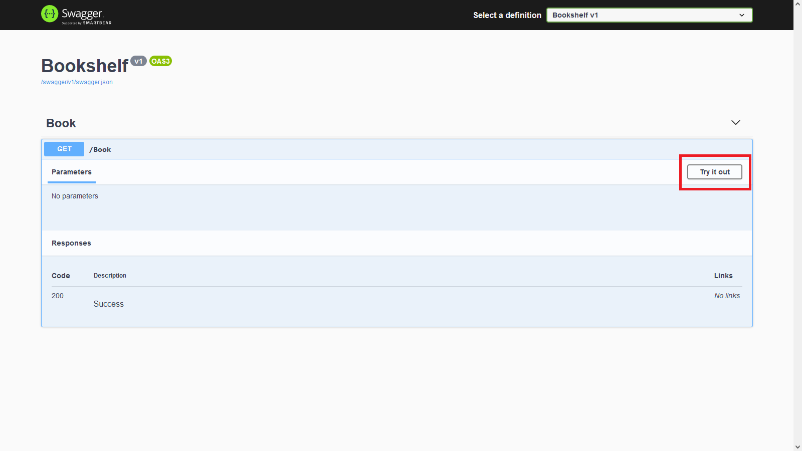

# ASP.NET Core API - A step-by-step guide

Let's implement a simple API using C# and ASP.NET Core.

## What are you going to learn?

- How to write APIs using C# and ASP.NET Core
- The Repository Pattern
- How to test API endpoints using Swagger

## Prerequisites

- IDE (preferably JetBrains Rider)
- .NET 5.0+ SDK
- PostgreSQL 12+

## Tasks

1. Setting up the project.

   - Open JetBrains Rider and select "Create New Project".
   - Select "ASP.NET Core Web Application" and choose the "Web API" type.
   - Choose the .NET version of your choice (e.g., .NET 6.0).
   - Give your project the name "Bookshelf" and click "Create".

2. Installing the required packages.

   - In the Solution Explorer, right-click on "Dependencies" and choose "Manage NuGet Packages"
   - Search for "Npgsql"
   - Click on the "+" icon to install it

3. Setting up the database.

   - Open PgAdmin and create a new database

     ```sql
     CREATE DATABASE bookshelf;
     ```
   - Open the SQL Shell or GUI and connect to your database

     ```sql
     USE bookshelf;
     ```
   - Create a new table

     ```sql
     CREATE TABLE books (
         id SERIAL PRIMARY KEY,
         title VARCHAR(255),
         author VARCHAR(255),
         published_date DATE
     );
     ```

4. Create the models.

   - Create the `Models` namespace/directory in the root folder of your project
   - Create a new class called `Book`

     ```csharp
     using System;

     namespace Bookshelf.Models
     {
         public class Book
         {
             public int Id { get; set; }
             public string Title { get; set; }
             public string Author { get; set; }
             public DateTime PublishedDate { get; set; }
         }
     }
     ```

5. Create the query repositories.

   - Create the `Repositories` namespace/directory in the `Models` folder of your project
   - Create a new class called `BookRepository` that requires a `NpgsqlConnection`

     ```csharp
     using Npgsql;

     namespace Bookshelf.Models.Repositories
     {
         public class BookRepository
         {
             private readonly NpgsqlConnection _connection;

             public BookRepository(NpgsqlConnection connection)
             {
                 _connection = connection;
             }
         }
     }
     ```

6. Create a controller.

   - Create the `BookController` class inside the `Controllers` folder of your project

     ```csharp
     using Microsoft.AspNetCore.Mvc;

     namespace Bookshelf.Controllers
     {
         [ApiController]
         [Route("[controller]")]
         public class BookController : ControllerBase
         {}
     }
     ```

   - Add the database connection string to your controller as a read-only field

     ```csharp
     private readonly string _connectionString = "Server=localhost;Port=5432;User Id=YOUR_POSGRESQL_USER;Password=YOUR_PASSWORD;Database=bookshelf";
     ```

7. Get all books.

   - Write a method inside the `BookRepository` class that selects all books from the `books` table

     ```csharp
     public List<Book> GetAll()
     {
         _connection.Open();
         var adapter = new NpgsqlDataAdapter("SELECT * FROM books", _connection);

         var dataSet = new DataSet();
         adapter.Fill(dataSet);
         var table = dataSet.Tables[0];

         var queryResult = new List<Book>();
         foreach (DataRow row in table.Rows)
         {
             queryResult.Add(new Book
             {
                 Id = (int)row["id"],
                 Title = (string)row["title"],
                 Author = (string)row["author"],
                 PublishedDate = (DateTime)row["published_date"]
             });
         }

         _connection.Close();

         return queryResult;
     }
     ```

   - Don't forget to add the missing dependencies to the `BookRepository` class

     ```csharp
     using System;
     using System.Collections.Generic;
     using System.Data;
     using Npgsql;
     ```

   - Create a new route in the `BookController` class that uses the `GET` HTTP Request Method

     ```csharp
     [HttpGet]
     public IActionResult GetAll()
     {
         var repository = new BookRepository(new NpgsqlConnection(_connectionString));

         return Ok(repository.GetAll());
     }
     ```

   - Add the missing dependencies to the `BookController` class

     ```csharp
     using Bookshelf.Models;
     using Bookshelf.Models.Repositories;
     using Microsoft.AspNetCore.Mvc;
     using Npgsql;
     ```

   - Run the application and navigate to the `/swagger` route in your web browser

     * You should see the `[GET] /Book` route

   - If you click on the `[GET] /Book` route, you can try it out (similarly as with Postman)

     

8. Get one book by its `id`.

   - Write a method inside the `BookRepository` class that selects one book by its `id` from the `books` table

     ```csharp
     public Book GetById(int id)
     {
         _connection.Open();
         var adapter = new NpgsqlDataAdapter("SELECT * FROM books WHERE id = :id", _connection);
         adapter.SelectCommand?.Parameters.AddWithValue(":id", id);

         var dataSet = new DataSet();
         adapter.Fill(dataSet);
         var table = dataSet.Tables[0];

         if (table.Rows.Count > 0)
         {
             DataRow row = table.Rows[0];
             return new Book
             {
                 Id = (int)row["id"],
                 Title = (string)row["title"],
                 Author = (string)row["author"],
                 PublishedDate = (DateTime)row["published_date"]
             };
         }

         _connection.Close();

         return null;
     }
     ```

   - Create a new route in the `BookController` class that uses the `GET` HTTP Request Method

     ```csharp
     [HttpGet("{id}")]
     public IActionResult GetById(int id)
     {
         var repository = new BookRepository(new NpgsqlConnection(_connectionString));

         return Ok(repository.GetById(id));
     }
     ```

   - Run the application and navigate to the `/swagger` route in your web browser

     * You should see the `[GET] /Book/{id}` route

9. Create a book.

   - Write a method inside the `BookRepository` class that creates a new book in the `books` table

     ```csharp
     public int Create(Book book)
     {
         _connection.Open();
         var adapter = new NpgsqlDataAdapter(
             "INSERT INTO books (title, author, published_date) VALUES (:title, :author, :published_date) RETURNING id",
             _connection
         );
         adapter.SelectCommand?.Parameters.AddWithValue(":title", book.Title);
         adapter.SelectCommand?.Parameters.AddWithValue(":author", book.Author);
         adapter.SelectCommand?.Parameters.AddWithValue(":published_date", book.PublishedDate);

         var lastInsertId = (int)adapter.SelectCommand?.ExecuteScalar();
         _connection.Close();

         return lastInsertId;
     }
     ```

   - Create a new route in the `BookController` class that uses the `POST` HTTP Request Method

     ```csharp
     [HttpPost()]
     public IActionResult Create(Book book)
     {
         var repository = new BookRepository(new NpgsqlConnection(_connectionString));

         return Ok(repository.Create(book));
     }
     ```

   - Run the application and navigate to the `/swagger` route in your web browser

     * You should see the `[POST] /Book` route

10. Update a book.

   - Write a method inside the `BookRepository` class that updates an existing book in the `books` table

     ```csharp
     public void Update(Book book)
     {
         _connection.Open();
         var adapter = new NpgsqlDataAdapter(
             "UPDATE books SET title = :title, author = :author, published_date = :published_date WHERE id = :id",
             _connection
         );
         adapter.SelectCommand?.Parameters.AddWithValue(":title", book.Title);
         adapter.SelectCommand?.Parameters.AddWithValue(":author", book.Author);
         adapter.SelectCommand?.Parameters.AddWithValue(":published_date", book.PublishedDate);
         adapter.SelectCommand?.Parameters.AddWithValue(":id", book.Id);

         adapter.SelectCommand?.ExecuteNonQuery();
         _connection.Close();
     }
     ```

   - Create a new route in the `BookController` class that uses the `PUT` HTTP Request Method

     ```csharp
     [HttpPut()]
     public IActionResult Update(Book book)
     {
         var repository = new BookRepository(new NpgsqlConnection(_connectionString));
         repository.Update(book);

         return Ok();
     }
     ```

   - Run the application and navigate to the `/swagger` route in your web browser

     * You should see the `[PUT] /Book` route

11. Delete a book.

   - Write a method inside the `BookRepository` class that deletes an existing book from the `books` table

     ```csharp
     public void Delete(int id)
     {
         _connection.Open();
         var adapter = new NpgsqlDataAdapter(
             "DELETE FROM books WHERE id = :id",
             _connection
         );
         adapter.SelectCommand?.Parameters.AddWithValue(":id", id);

         adapter.SelectCommand?.ExecuteNonQuery();
         _connection.Close();
     }
     ```

   - Create a new route in the `BookController` class that uses the `DELETE` HTTP Request Method

     ```csharp
     [HttpDelete("{id}")]
     public IActionResult Delete(int id)
     {
         var repository = new BookRepository(new NpgsqlConnection(_connectionString));
         repository.Delete(id);

         return Ok();
     }
     ```

   - Run the application and navigate to the `/swagger` route in your web browser

     * You should see the `[DELETE] /Book/{id}` route

## Hints

- Note that this tutorial focuses on the very basics of ASP.NET Core and does not necessarily use all the best practices to avoid complex concepts
- You can define an `IBookRepository` interface to abstract away the methods inside the `BookRepository` class (for examples, check out the video about the Repository Pattern under the background materials)
- If you don't want the web browser to start after starting the web server, you can disable it by setting the `launchBrowser` property of the `Properties\launchSettings.json` file to `false`
- Your web browser might warn you about some security risks. This is due to the lack of an SSL certificate that is required for HTTPS communication. Since this project only runs on your machine, just accept the risk and move forward
- If you want to access the endpoints from a frontend application, you will have to enable cross-origin requests

## Background materials

- 📖 [The Model View Controller Pattern](https://www.freecodecamp.org/news/the-model-view-controller-pattern-mvc-architecture-and-frameworks-explained/)
- 🎥 [Learn ASP.NET](https://dotnet.microsoft.com/en-us/learn/aspnet)
- 🎥 [Repository Pattern](https://youtu.be/x6C20zhZHw8)
- 📖 [What Is Swagger?](https://swagger.io/docs/specification/2-0/what-is-swagger/)
- 🍭 [Enable Cross-Origin Requests (CORS) in ASP.NET Core](https://learn.microsoft.com/en-us/aspnet/core/security/cors)
